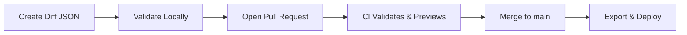

# Recipe Aligner

A web-based research tool for aligning and comparing historic Kyphi incense recipes across multiple sources, backed by structured JSON data and automation helpers for keeping the dataset consistent.

## 🌐 Live Demo

Visit: `https://alchemiesofscent.github.io/recipe-aligner/`

## ✨ Key Features

- 🔍 Interactive search and filtering across recipes and ingredients
- 📊 Side-by-side alignment table with sticky headers for long recipe lists
- 📚 Clean data pipeline that keeps diff files, the master dataset, and published exports in sync
- 🤖 Automated validation scripts plus GitHub Actions integration for pull requests
- 📤 One-click CSV/JSON exports tailored for downstream analysis
- 📱 Responsive UI that works well on desktop and mobile

## 📁 Repository Structure

```
recipe-aligner/
├── docs/                          # GitHub Pages site (served from /docs)
│   ├── index.html                 # Front-end application
│   ├── kyphi_long.json            # Published dataset used by the app (auto-generated)
│   └── equivalences.json          # Ingredient equivalence metadata (auto-generated)
├── data/                          # Authoritative data under version control
│   ├── MASTER.json                # Canonical dataset (don't edit by hand)
│   ├── schema_master.json         # JSON Schema for MASTER.json
│   ├── schema_diff.json           # JSON Schema for incoming diffs
│   └── 20250903 kyphi recipes raw data.txt  # Source transcription notes
├── diffs/                         # Incoming data additions
│   └── processed/                 # Archived diffs after merge
├── scripts/                       # Data management utilities
│   ├── merge_diff.py              # Apply a diff file to MASTER.json
│   ├── export_long.py             # Export MASTER.json to docs/kyphi_long.json
│   ├── remove_diff.py             # Remove a previously merged diff
│   ├── validate_diff.py           # Validate diff files against schema
│   ├── build_equivalences.py      # Rebuild docs/equivalences.json from MASTER.json
│   ├── generate_equivalences.py   # Helper for ingredient linking workflows
│   ├── ingredient_db.py           # Ingredient database helpers
│   ├── link_ingredients.py        # Link ingredient variants across recipes
│   └── diagnose_json.py, fix_json.py  # JSON cleanup helpers
└── .github/workflows/
    └── validate.yml               # CI validation for pull requests
```

## 🔄 Workflow Overview

### 1. Data Ingestion


### 2. Step-by-Step
1. 📝 Create diff files that follow the schema (see template below)
2. ✅ Validate locally: `python scripts/validate_diff.py diffs/my_diff.json`
3. 📋 Open a pull request — CI runs `scripts/validate_diff.py` automatically
4. 🔍 Review and merge — merged diffs update MASTER.json
5. 🌐 Regenerate exports for the live site: `python scripts/export_long.py data/MASTER.json docs/kyphi_long.json`
6. 🧭 (Optional) Refresh equivalence data: `python scripts/build_equivalences.py`

## 🚀 Quick Start

```bash
# Clone and enter the project
git clone https://github.com/alchemiesofscent/recipe-aligner.git
cd recipe-aligner

# (Optional) Activate a virtual environment
python -m venv .venv
source .venv/bin/activate
pip install -r requirements.txt  # if present

# Validate example diffs
python scripts/validate_diff.py diffs/*.json

# Merge a diff into MASTER.json (dry-run recommended!)
python scripts/merge_diff.py data/MASTER.json diffs/example.json "example-source"

# Export the dataset used by the app
python scripts/export_long.py data/MASTER.json docs/kyphi_long.json
python scripts/build_equivalences.py  # regenerate equivalence helper data

# Run the static site locally
cd docs
python -m http.server 8000
# Visit http://localhost:8000 in your browser
```

### Enable GitHub Pages
1. Settings → Pages
2. Source: **Deploy from branch**
3. Branch: **main**, Folder: **/docs**
4. Save; deployment finishes in a few minutes

## 📋 Diff File Template (`diffs/YYYY-MM-DD-source.json`)

```json
{
  "recipes": [
    {
      "slug": "dioscorides-kyphi",
      "label": "Dioscorides Kyphi",
      "source": "De Materia Medica",
      "language": "grc"
    }
  ],
  "ingredients": [
    {
      "slug": "myrrh",
      "label": "σμύρνα",
      "language": "grc"
    }
  ],
  "aliases": [
    {
      "ingredient_slug": "myrrh",
      "variant_label": "myrrh",
      "language": "en"
    }
  ],
  "entries": [
    {
      "recipe_slug": "dioscorides-kyphi",
      "ingredient_slug": "myrrh",
      "amount_raw": "δραχμὰς 16",
      "amount_value": 16,
      "amount_unit": "drachm",
      "preparation": "powdered",
      "notes": "best quality"
    }
  ]
}
```

## 🛠 Local Development Tools

### 🚀 Quick Ingestion (Recommended)

Use the Claude Code slash command for interactive recipe ingestion:

```bash
/ingest-recipe
```

This will guide you through:
- Parsing recipe text
- Matching ingredients with fuzzy search
- Updating equivalence groups
- Generating validated diff JSON
- Committing to git

### 🔧 Manual Workflow

```bash
# Helper tools for ingredient matching
python3 scripts/assist_ingestion.py --fuzzy-match "myrrh"
python3 scripts/assist_ingestion.py --validate-slug "smyrne"
python3 scripts/assist_ingestion.py --suggest-slug "σμύρνη" --lang grc
python3 scripts/assist_ingestion.py --equivalence-for "myrrh"

# Equivalence management
python3 scripts/update_equivalences.py --suggest-for-diff diffs/new.json
python3 scripts/update_equivalences.py --validate
python3 scripts/update_equivalences.py --interactive

# Validate and process diffs
python3 scripts/validate_diff.py diffs/my_diff.json
python3 scripts/merge_diff.py data/MASTER.json diffs/my_diff.json "source"

# Export data for the web app
python3 scripts/export_long.py data/MASTER.json docs/kyphi_long.json

# Remove a diff if you need to undo it
python3 scripts/remove_diff.py data/MASTER.json diffs/my_diff.json "removal-notes"
```

All scripts surface progress indicators, helpful diagnostics, and validation hints to keep the dataset healthy.

## 🧱 Data Requirements

- Python 3.8+
- `jsonschema` library (`pip install jsonschema`)

## 📦 What the CI Checks

- JSON Schema validation for new diff files
- Referential integrity between recipes, ingredients, aliases, and entries
- Duplicate slug detection inside diffs
- Summary statistics to highlight the impact of changes

## 🧭 System Architecture

```
┌─────────────────┐    ┌──────────────────┐    ┌────────────────────┐
│   Diff Files    │───▶│   MASTER.json    │───▶│  Web App Exports   │
│  (human input)  │    │ (canonical store)│    │ (kyphi_long.json)  │
└─────────────────┘    └──────────────────┘    └────────────────────┘
        ▲                        ▲                        ▲
        │                        │                        │
   Contributors             Automation scripts        GitHub Pages

Schema Validation ─▶ Merge ─▶ Equivalence Build ─▶ Export ─▶ Deploy
```

## 🤝 Contributing

### Adding Recipe Data
- Fork the repository and create `diffs/YYYY-MM-DD-source.json`
- Run `python scripts/validate_diff.py diffs/your_diff.json`
- Open a pull request summarizing the source
- Review CI feedback, iterate, and merge when ready

### Improving Tooling or UI
- Follow the patterns used in existing scripts and front-end assets
- Prefer incremental pull requests with clear testing notes
- Update documentation and schemas when adding new fields or behaviors

## 🐛 Troubleshooting

- Validation failing: run `python scripts/validate_diff.py ...` to see detailed errors
- Unknown slugs: ensure `recipe_slug` and `ingredient_slug` exist in the diff payload
- Blank app: regenerate exports with `python scripts/export_long.py` and restart the local server
- CI failures: inspect the **Actions** tab for log output from `validate.yml`

---

Built with ❤️ for digital humanities research. For support or discussion, open an issue or visit [GitHub Discussions](https://github.com/alchemiesofscent/recipe-aligner/discussions).
